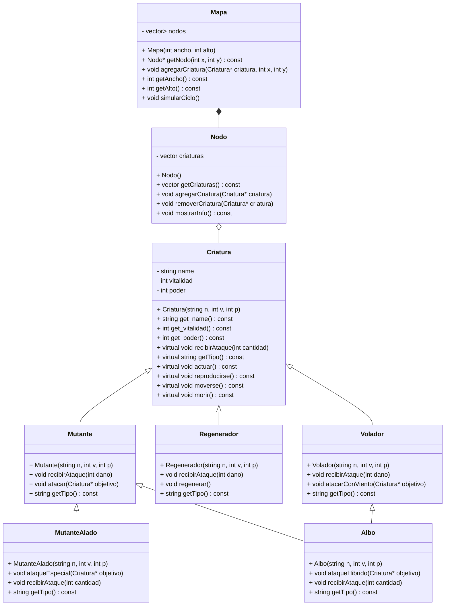

```mermaid
classDiagram
    class Criatura {
        - string name
        - int vitalidad
        - int poder
        + Criatura(string n, int v, int p)
        + string get_name() const
        + int get_vitalidad() const
        + int get_poder() const
        + virtual void recibirAtaque(int cantidad)
        + virtual string getTipo() const
        + virtual void actuar() const
        + virtual void reproducirse() const
        + virtual void moverse() const
        + virtual void morir() const
    }

    class Mutante {
        + Mutante(string n, int v, int p)
        + void recibirAtaque(int dano)
        + void atacar(Criatura* objetivo)
        + string getTipo() const
    }

    class Regenerador {
        + Regenerador(string n, int v, int p)
        + void recibirAtaque(int dano)
        + void regenerar()
        + string getTipo() const
    }

    class Volador {
        + Volador(string n, int v, int p)
        + void recibirAtaque(int dano)
        + void atacarConViento(Criatura* objetivo)
        + string getTipo() const
    }

    class MutanteAlado {
        + MutanteAlado(string n, int v, int p)
        + void ataqueEspecial(Criatura* objetivo)
        + void recibirAtaque(int cantidad)
        + string getTipo() const
    }

    class Albo {
        + Albo(string n, int v, int p)
        + void ataqueHibrido(Criatura* objetivo)
        + void recibirAtaque(int cantidad)
        + string getTipo() const
    }

    class Nodo {
        - vector<Criatura*> criaturas
        + Nodo()
        + vector<Criatura*> getCriaturas() const
        + void agregarCriatura(Criatura* criatura)
        + void removerCriatura(Criatura* criatura)
        + void mostrarInfo() const
    }

    class Mapa {
        - vector<vector<Nodo*>> nodos 
        + Mapa(int ancho, int alto)
        + Nodo* getNodo(int x, int y) const
        + void agregarCriatura(Criatura* criatura, int x, int y)
        + int getAncho() const
        + int getAlto() const
        + void simularCiclo()
    }

    Criatura <|-- Regenerador
    Criatura <|-- Mutante
    Criatura <|-- Volador
    Mutante <|-- MutanteAlado
    Mutante <|-- Albo
    Volador <|-- Albo

    Mapa *-- Nodo
    Nodo o-- Criatura

```
